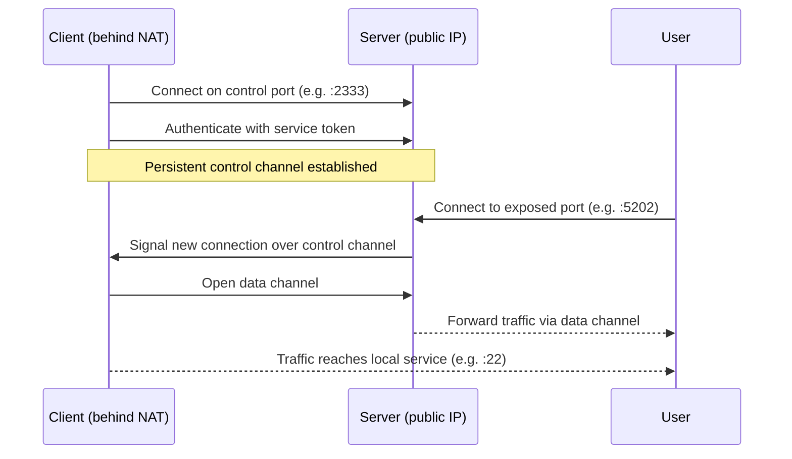

## What is rathole?

rathole helps you expose services running on devices behind NAT (Network Address Translation) to the internet. If you have a home server, NAS, Raspberry Pi, or any device that lacks a public IP address, rathole lets you reach it from anywhere using a server that does have a public IP.

Like [frp](https://github.com/fatedier/frp) and ngrok, rathole works by establishing a persistent connection from your private device outward to a public relay server. Incoming traffic to the relay is then forwarded back through that connection to the service on your local device.

## How it works

rathole has two components that work together:

- **Server** — runs on a machine with a public IP address. It listens for client connections on a control port and exposes each registered service on its own port.
- **Client** — runs on the device behind NAT. It connects outward to the server, authenticates using a per-service token, and forwards traffic between the server and the local service.

When a user connects to the server's exposed port, the server routes that traffic over the established control channel to the client, which delivers it to the local service. No inbound firewall rules or port forwarding are required on the client side.

## Key features

<CardGroup cols={2}>
  <Card title="High performance" icon="bolt">
    Higher throughput and more stable behavior under large connection volumes compared to similar tools. Benchmarks show significant improvements in both TCP bitrate and HTTP throughput.
  </Card>
  <Card title="Low resource consumption" icon="microchip">
    Consumes far less memory than comparable tools. The binary can be as small as ~500 KiB, making it suitable for embedded devices such as routers.
  </Card>
  <Card title="Strong security" icon="shield">
    Tokens are mandatory and scoped per service. Supports the Noise Protocol for encryption without self-signed certificates, as well as TLS. Both HTTP and SOCKS5 proxies are supported for the client connection.
  </Card>
  <Card title="Hot reload" icon="arrows-rotate">
    Services can be added or removed dynamically by editing and saving the configuration file — no restart required.
  </Card>
  <Card title="TCP and UDP" icon="network-wired">
    Supports forwarding both TCP and UDP services. Each service can independently specify its protocol.
  </Card>
  <Card title="Flexible transport" icon="shuffle">
    Transport layer is configurable per deployment: plain TCP, TLS, Noise Protocol, or WebSocket. Mix and match based on your security and infrastructure requirements.
  </Card>
</CardGroup>

## Architecture overview

The server and client each manage their own configuration. The server defines which ports to expose; the client defines which local services to forward. A shared token on each service is the only coupling between the two configs.

## Get started

<CardGroup cols={2}>
  <Card title="Quickstart" icon="rocket" href="/quickstart">
    Get a working SSH tunnel running in under five minutes.
  </Card>
  <Card title="Installation" icon="download" href="/installation">
    Install rathole via pre-built binary, Docker, or build from source.
  </Card>
  <Card title="Configuration" icon="sliders" href="/configuration/overview">
    Full reference for all server and client configuration options.
  </Card>
  <Card title="Security" icon="lock" href="/security/overview">
    Configure tokens, Noise Protocol encryption, and TLS transport.
  </Card>
</CardGroup>
